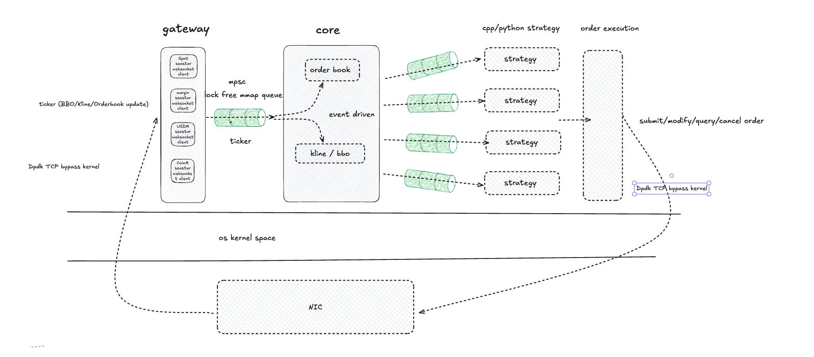

# crypto_trading

## Introduction

This is my side project cpp trading system for trading crypto with cpp & python, currently only support binance trading spot, margin, future, T2O latency estimately 2ms now.
Now I am tring improve a bit more and will finish it first version until end of June, then start spend time learning strategies.

## Arch

gatway - receive ticker data from exchange
core - get ticker data and maintain orderbook and other financial data structure and indicator (like kline, bbo, total quantity from buy/sell side)
strategy (cpp/python) - produce alpha signal.

## how to optimize
1. lock free queue to transmit ticker, improve throuput.
2. use mmap to do IPC, pure memory and zero copy.
3. cache friendly optimization, through memory alignment, struct of array array of struct, increase cache hit rate, reduce false sharing at same time.
4. use seastar library to implement websocket, can easily integrate DPDK to make network package by pass kernel.
5. use websocket api rather http api.
6. reduce if-else use or mark hot branch as likely, reduce cpu branch detection.
7. use unordered_dense rather than unordered_map, because it's memory continually and cache friendly.
8. use rapidjson to parse json, reduce memory copy.
9. use flatbuffer to deserliaze string to class object, reduce memory copy.
10. adjust mmap queue's page table bigger, reduce page fault.

## Next
1. lock free queue now implementation is not good and performance not best, either
   1) try to implment a better MPSC and SPMC queue (hard)
   2) use other solution popular at industry like nng, nanolog.

   finally option depends on latency.
2. clean code & refactor